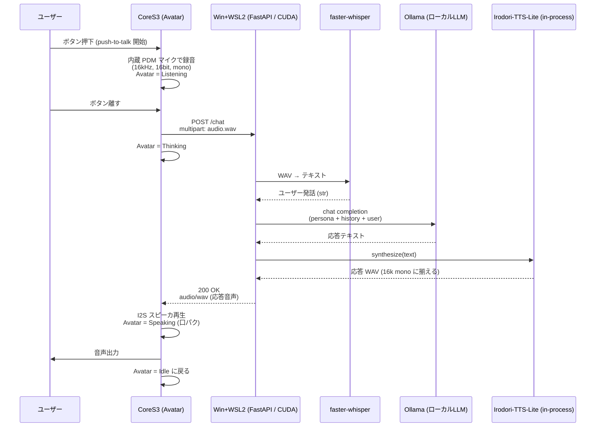

# アーキテクチャ詳細

## 全体シーケンス



## CoreS3 側の状態機械

```
┌────────┐  Btn press  ┌───────────┐ Btn release ┌──────────┐ HTTP 200 ┌──────────┐
│  Idle  │ ──────────► │ Listening │ ──────────► │ Thinking │ ───────► │ Speaking │ ─┐
└────────┘             └───────────┘             └──────────┘          └──────────┘ │
     ▲                                                                              │
     └─────────────────────── 再生完了 ──────────────────────────────────────────────┘
```

ぺけ子ちゃん表情マップ (デフォルト。`face_map.h` で変更可):

| Scene       | 表情 ID | 表情          | 備考 |
|-------------|---------|---------------|------|
| Boot done   | 36      | バイバイ      | 起動直後の挨拶 |
| Idle        | 01      | 中立          | 待機 |
| Listening   | 15      | ？マーク      | 録音中 |
| Thinking    | 21      | 手を顎に      | サーバ応答待ち |
| Speak (閉)  | 02      | 微笑み・口閉  | PCM RMS < 閾値 |
| Speak (開)  | 29      | 笑顔・口開    | PCM RMS ≥ 閾値 |
| Error WiFi  | 32      | あたふた      | Wi-Fi 失敗時 |
| Error HTTP  | 16      | パニック      | サーバ接続失敗 |
| No speech   | 06      | 困り (汗)     | 無音だった時 (将来用) |

## API 仕様

### GET /health

プロセスが起動しているかだけを見る軽量ヘルスチェック。レスポンスは `{"ok": true}`。

### GET /ready

STT / LLM / TTS の準備状態をまとめて返す。Ollama モデル未 pull、VOICEVOX 未起動などの切り分けに使う。

```json
{
  "ok": true,
  "components": {
    "stt": {"ok": true},
    "llm": {"ok": true},
    "tts": {"ok": true}
  }
}
```

Irodori 経路では `tts.calls`, `tts.last_infer_ms`, `tts.last_convert_ms`, `tts.last_total_ms` も返る。

### POST /chat

**Request**: `multipart/form-data`

| Field    | Type   | 説明 |
|----------|--------|------|
| `audio`  | file   | WAV (RIFF, PCM16, 16kHz, mono) |
| `sid`    | string | セッションID。会話履歴保持用 (任意) |

**Response**:

- 成功: `200 OK`, `Content-Type: audio/wav`, body = 合成 WAV
- 失敗: `4xx/5xx`, JSON `{"error": "..."}`

デバッグ用に次のヘッダを返す。

| Header | 説明 |
|--------|------|
| `X-Stackchan-User-Text` | STT 結果。URL エンコード済み |
| `X-Stackchan-Bot-Text` | 応答テキスト。URL エンコード済み |
| `X-Stackchan-Timing` | `stt;dur=...`, `llm;dur=...`, `tts;dur=...`, `total;dur=...` の処理時間 |
| `X-Stackchan-TTS-Backend` | `irodori` または `voicevox` |
| `X-Stackchan-Emote` | 発話テキストから推定した感情タグ。CoreS3 側で口パク表情ペアを切り替える ([§感情タグ仕様](#感情タグ-x-stackchan-emote)) |

CoreS3 側のシリアルログにも `[TIME]` / `[TTS ]` として表示する。

### POST /chat_text

`text` を直接 LLM に渡して、応答文を TTS した WAV を返す。マイクなしで LLM + TTS の疎通を見る用途。

| Field | Type | 説明 |
|-------|------|------|
| `text` | string | ユーザー発話テキスト |
| `sid` | string | セッションID。会話履歴保持用 (任意) |

### POST /speak

`text` を直接 TTS した WAV を返す。Irodori / VOICEVOX 単体の切り分け用。

| Field | Type | 説明 |
|-------|------|------|
| `text` | string | 合成したいテキスト |

### GET /pull

CoreS3 から定期発話 / 外部 push を取りに行く long-poll エンドポイント。

| Query | Type | 説明 |
|-------|------|------|
| `wait` | float (秒) | 0..60。0 なら即時応答、>0 なら最大その秒数まで待機 |

**Response**:
- キュー空: `204 No Content`
- 発話あり: `200 OK`, `Content-Type: audio/wav`, body = WAV

| Header | 説明 |
|--------|------|
| `X-Stackchan-Bot-Text` | 発話テキスト (URL エンコード済み) |
| `X-Stackchan-Source` | 発信元タグ。`sched:<name>` (定期発話) / `ext:<sid>` (外部 push) |
| `X-Stackchan-Emote` | 感情タグ ([§感情タグ仕様](#感情タグ-x-stackchan-emote)) |

### POST /enqueue

定期発話キューに外部から発話を積む。Discord bot や手元の curl 連携に使う。

| Field | Type | 説明 |
|-------|------|------|
| `text` | string | 発話または LLM 用プロンプト |
| `via_llm` | bool | `true` なら text をプロンプトとして LLM 経由、`false` ならそのまま TTS (デフォルト false) |
| `sid` | string | LLM セッションID (`via_llm=true` のときの履歴管理用、既定 `external`) |

**Response**: `200 OK`, `{"ok": true, "bot_text": "...", "queue_size": N}` / 満杯時 `503`

`/enqueue` は `ENQUEUE_TOKEN` が設定されている場合だけ有効。呼び出し側は
`X-Stackchan-Token: <ENQUEUE_TOKEN>` を付ける。未設定時は `403`、トークン不一致は `401`。
キュー満杯時は LLM / TTS を実行する前に `503` を返す。

### GET /scheduler/status

スケジューラの状態と次回発火予定をまとめて返す。デバッグ用。

```json
{
  "enabled": true,
  "running": true,
  "triggers": [
    {"name": "morning_greet", "cron": "0 8 * * *", "kind": "llm", "next": "2026-05-22T08:00:00"}
  ],
  "queue_size": 0
}
```

## ピン/ハード設定

CoreS3 SE は I2C 周辺と内蔵マイク/スピーカが固定のため、基本は M5Unified が面倒を見る。
スタックちゃんの首振りサーボは **Feetech SCS0009 シリアルサーボ ×2** を StackChan 基板経由で UART 半二重接続している (PWM SG90 ではない)。

| 用途        | ピン / ID                       | メモ |
|-------------|----------------------------------|------|
| 首 Yaw      | UART TX=GPIO6, RX=GPIO7 / ID=1   | 1 Mbps、SN74LVC1G126DC が方向を自動切替 |
| 首 Pitch    | 同 UART / ID=2                   | 0-1023 step で 300° (1 step ≈ 0.293°) |
| 内蔵マイク  | M5.Mic                           | M5Unified 経由 |
| 内蔵スピーカ| M5.Speaker                       | M5Unified 経由 |

サーボ未接続のまま動かしたい場合は `firmware/include/config.h` の `SERVO_ENABLED` を `0` にする。実装は `firmware/include/servo_controller.h`。

## なぜこの分担か

- ESP32-S3 では現実的に小さな LLM すら走らせられない (PSRAM 8MB、Flash 16MB)
- 一方で I/O (マイク・スピーカ・Avatar 表示・サーボ) はリアルタイム性が要るのでオンデバイス
- 母艦は Irodori-TTS-Lite が CUDA + Triton 前提なので Windows + WSL2 (Ubuntu) + NVIDIA GPU 構成。faster-whisper / Ollama も同じ GPU を共有して in-process で走る
- HTTP は CoreS3 ↔ 母艦の境界だけに残しておけば、母艦を後で別の Linux GPU マシンに移しても CoreS3 側は無改造で動く

## サーバ設定の要点

`.env` で LLM の応答長・温度・タイムアウトを調整できる。会話履歴は `sid` ごとにメモリ保持し、`MAX_SESSIONS` を超えた古いセッションは破棄する。`MAX_AUDIO_BYTES` より大きい `/chat` 入力は `413` で拒否する。

## 定期発話 / 外部 push

`/chat` 経由のリアクティブな会話とは別に、サーバ起点で CoreS3 を喋らせる経路を用意してある。

```
              ┌─────────────────┐
              │ scheduler.py    │ croniter で時刻判定
              │  (asyncio task) │   ↓ 30秒ごとに点検
              └────────┬────────┘
   trigger 発火        ↓
                LLM (kind=llm) または固定文 → TTS → 合成 WAV
                                                ↓
              ┌──────────────────────┐
              │ utterance_queue      │  (asyncio.Queue, max=QUEUE_MAX_SIZE)
              └──────────┬───────────┘
                         ↓
                  GET /pull?wait=N (CoreS3 から)
                         ↓
                    WAV を返して再生
```

外部 (Discord bot / curl) からも `POST /enqueue` で同じキューに積める。`/enqueue` は LAN から到達できるため、`ENQUEUE_TOKEN` を `.env` に設定し、呼び出し時に `X-Stackchan-Token` ヘッダを付ける。CoreS3 側は Idle 中に 30 秒ごとに `GET /pull?wait=0` で短ポーリングして、応答があれば既存の lipsync 経路で再生する。

### 設定ファイル `schedule.json`

[server/schedule.json.example](../server/schedule.json.example) をコピーして編集。

```json
{
  "triggers": [
    {
      "name": "morning_greet",
      "cron": "0 8 * * *",
      "kind": "llm",
      "prompt": "おはよう。今日の朝の挨拶を一言だけしてくれる",
      "sid": "scheduled"
    },
    {
      "name": "lunch_reminder",
      "cron": "30 12 * * *",
      "kind": "fixed",
      "text": "そろそろお昼の時間だよ、休憩しよう"
    }
  ]
}
```

- `kind: "llm"` — `prompt` を LLM に投げて応答を発話。会話履歴は `sid` (既定 `scheduled`) に蓄積されるので、定期発話どうしで人格が一貫する
- `kind: "fixed"` — `text` をそのまま TTS

`SCHEDULE_ENABLED=1` で起動時にスケジューラが始動する。トリガが無い / ファイルが無い場合は何もしない (`/pull` と `/enqueue` は使える)。

### Fixed トリガの事前合成 & ディスクキャッシュ

`kind: "fixed"` は text が不変なので、`Scheduler.start()` 時点で 1 回だけ `tts.synthesize()` を回して合成済み WAV bytes をトリガに紐づけてキャッシュする。以後の発火 (cron が時刻に達するたび) は TTS を呼ばずにキャッシュからキューへ積むので、毎回の発火コストが大幅に下がる (Irodori 経路で数秒 → ほぼゼロ)。`kind: "llm"` は応答が毎回違うのでキャッシュしない。

`TTS_CACHE_DIR` を設定すると、この事前合成結果が **`<dir>/<sha256(version + text)>.wav`** にディスク永続化される。同じ `schedule.json` でサーバを再起動すると、起動時 pre-synth は Irodori を呼ばずにディスクから即時ロードされる。`/enqueue` の `via_llm=false` 経路にも同じキャッシュが効くので、同じ定型文を頻繁に投げる連携 (Discord bot の決まり文句など) でも合成は一度だけ。声を変えた場合 (`IRODORI_REF_WAV` 差し替え、VOICEVOX 話者変更) は `TTS_CACHE_DIR` を消すか `TTS_CACHE_VERSION` を bump する。

## 会話履歴の永続化

`LLM_HISTORY_DB` を指定すると、`sid` ごとの (user, assistant) 履歴が SQLite に追記され、`uvicorn` 再起動を跨いで保持される。起動時に `MAX_SESSIONS` を超える古いセッションは破棄、各 sid の直近 `HISTORY_TURNS` 往復だけがハイドレートされる。未指定なら従来通り in-memory のみ。`/reset` (POST) は in-memory と DB の両方から該当 sid を消す。

## 時間文脈の自動注入

LLM への各リクエストでは、`SYSTEM_PROMPT` の直後に **2 つめの system message** として時刻情報を差し込んでいる。例:

```
[現在時刻: 2026-05-22 (木) 14:30  前回の会話: 3 時間 12 分前]
```

- `現在時刻` 部分は毎ターン更新される
- `前回の会話` 部分は `LLM_HISTORY_DB` が有効でかつ過去履歴がある時のみ付く。`HistoryStore.last_ts(sid)` を見て自然な和文 (`3 時間 12 分前`、`ついさっき` など) に整形
- `SYSTEM_PROMPT` 本体は不変なので Ollama 側のプロンプトキャッシュは効いたまま

これで「もう夕方だね」「昨日の話の続きだけど」のような時間感覚のある発話が自然に出る。

### 時間帯フレーバ

時刻表示に加えて、3 つ目の system message として **時間帯ごとの気分フレーバ** を差し込む (デフォルト ON、`LLM_TIME_FLAVOR=0` で無効化)。

| 時間帯 | フレーバ |
|---|---|
| 0–5 | 深夜、小声・眠そう・ぼそぼそ気味 |
| 5–9 | 早朝、まだ目覚めきれてない・あくび混じり |
| 9–12 | 午前、テンポ良く軽快 |
| 12–14 | お昼、お腹空いてる感を少し |
| 14–17 | 午後、眠気でちょっとぼんやり |
| 17–21 | 夕方〜夜、リラックスして落ち着いた声色 |
| 21–24 | 夜遅め、ふんわり眠そう・しっとり |

定義は [`server/llm.py`](../server/llm.py) の `_TIME_OF_DAY_FLAVORS`。セリフを直接指定せず「雰囲気だけ」LLM に渡す方が破綻しにくい。

### 照れ反応 (ユーザの褒めへの自動応答)

`/chat` および `/chat_text` の経路では、**ユーザ発話**に「かわいい / えらい / すごい / 好き / ありがとう / 上手 / 天才」などの褒め系キーワードが含まれていれば、応答テキストの内容に関わらず `X-Stackchan-Emote` を強制的に `embarrassed` に倒す。CoreS3 側はその間 `F_BASHFUL` (はにかみ) と `F_EMBARRASSED` で口パクするので、褒められた瞬間に表情が照れに切り替わる。実装は [`server/emote.py`](../server/emote.py) の `classify_reaction(user_text, bot_text)` と `_PRAISE_KEYWORDS`。

### `silent_for_minutes` トリガ (能動的声かけ)

スケジューラの ScheduledTrigger に追加できるオプション。指定値以上ユーザが沈黙していたときだけ発火する (cron で時刻が来ても skip)。「3 時間誰も話しかけてこなかったら寂しがる」のような能動的な声かけに使える。

```json
{
  "name": "miss_you",
  "cron": "*/30 * * * *",
  "kind": "llm",
  "prompt": "しばらく話しかけてもらえてない。寂しがる雰囲気で一言、軽く呼びかけてみて",
  "silent_for_minutes": 180,
  "check_sid": "stackchan-01"
}
```

- `silent_for_minutes` — 沈黙時間の閾値 (分)
- `check_sid` — 監視対象の sid。CoreS3 が `/chat` で使う sid を指定 (firmware の `SESSION_ID`、既定 `"stackchan-01"`)。`trigger.sid` (LLM 履歴用) とは別物
- `LLM_HISTORY_DB` が未設定 / 履歴ゼロの場合は「沈黙そのもの」とみなして発火する

## 感情タグ (X-Stackchan-Emote)

サーバは bot_text に含まれるキーワードから単純な感情タグを推定し、`X-Stackchan-Emote` ヘッダで返す。CoreS3 側はこのタグで発話中の口パクペア (`FACE_SPEAK_OPEN` / `FACE_SPEAK_CLOSED`) を切り替えるので、内容に合わせて表情が変わる。

| タグ | 既定の (口閉, 口開) | トリガ例 |
|------|---------------------|----------|
| `neutral`     | `F_SMILE` / `F_DETERMINED`     | 既定 / 未マッチ |
| `joy`         | `F_SOFT_SMILE` / `F_JOY`       | 「やったー」「X68 最高」「うれしい」 |
| `surprised`   | `F_SPARKLE_EYES` / `F_SURPRISED` | 「えっ、」「まじで」「すごい」 |
| `sad`         | `F_SAD` / `F_CRYING`           | 「悲しい」「つらい」「泣き」 |
| `embarrassed` | `F_BASHFUL` / `F_EMBARRASSED`  | 「ごめん」「申し訳」 |
| `confused`    | `F_QUESTION` / `F_POUT`        | 「わからない」「うーん」「えっと」 |
| `sleepy`      | `F_SLEEPING` / `F_YAWN_SMALL`  | 「眠い」「あくび」「おやすみ」 |
| `confident`   | `F_SOFT_SMILE` / `F_CONFIDENT` | 「まかせて」「大丈夫」「もちろん」 |

判定ロジックは [`server/emote.py`](../server/emote.py) の `_RULES` (キーワード優先順位リスト)。タグ ↔ 表情のマップは [`firmware/include/face_map.h`](../firmware/include/face_map.h) の `resolve_speak_pair()` にあり、配役の差し替えはどちらも 1 箇所で完結する。未知タグ / 空文字は既定値にフォールバック。
