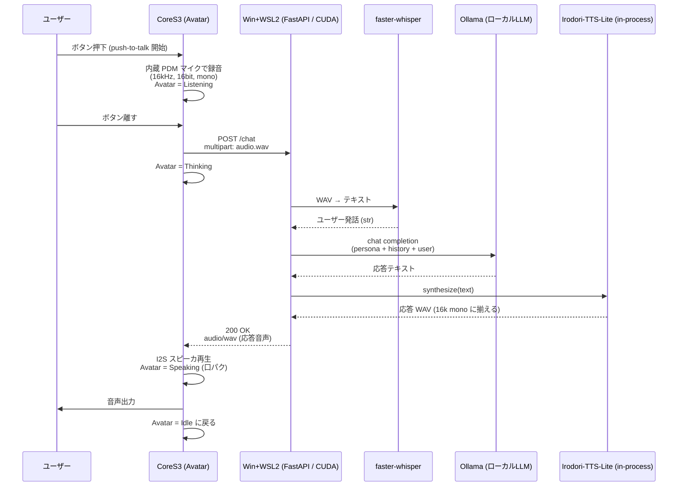

# アーキテクチャ詳細

## 全体シーケンス



## CoreS3 側の状態機械

```
┌────────┐  Btn press  ┌───────────┐ Btn release ┌──────────┐ HTTP 200 ┌──────────┐
│  Idle  │ ──────────► │ Listening │ ──────────► │ Thinking │ ───────► │ Speaking │ ─┐
└────────┘             └───────────┘             └──────────┘          └──────────┘ │
     ▲                                                                              │
     └─────────────────────── 再生完了 ──────────────────────────────────────────────┘
```

ぺけ子ちゃん表情マップ (デフォルト。`face_map.h` で変更可):

| Scene       | 表情 ID | 表情          | 備考 |
|-------------|---------|---------------|------|
| Boot done   | 36      | バイバイ      | 起動直後の挨拶 |
| Idle        | 01      | 中立          | 待機 |
| Listening   | 15      | ？マーク      | 録音中 |
| Thinking    | 21      | 手を顎に      | サーバ応答待ち |
| Speak (閉)  | 02      | 微笑み・口閉  | PCM RMS < 閾値 |
| Speak (開)  | 29      | 笑顔・口開    | PCM RMS ≥ 閾値 |
| Error WiFi  | 32      | あたふた      | Wi-Fi 失敗時 |
| Error HTTP  | 16      | パニック      | サーバ接続失敗 |
| No speech   | 06      | 困り (汗)     | 無音だった時 (将来用) |

## API 仕様

### GET /health

プロセスが起動しているかだけを見る軽量ヘルスチェック。レスポンスは `{"ok": true}`。

### GET /ready

STT / LLM / TTS の準備状態をまとめて返す。Ollama モデル未 pull、VOICEVOX 未起動などの切り分けに使う。

```json
{
  "ok": true,
  "components": {
    "stt": {"ok": true},
    "llm": {"ok": true},
    "tts": {"ok": true}
  }
}
```

Irodori 経路では `tts.calls`, `tts.last_infer_ms`, `tts.last_convert_ms`, `tts.last_total_ms` も返る。

### POST /chat

**Request**: `multipart/form-data`

| Field    | Type   | 説明 |
|----------|--------|------|
| `audio`  | file   | WAV (RIFF, PCM16, 16kHz, mono) |
| `sid`    | string | セッションID。会話履歴保持用 (任意) |

**Response**:

- 成功: `200 OK`, `Content-Type: audio/wav`, body = 合成 WAV
- 失敗: `4xx/5xx`, JSON `{"error": "..."}`

デバッグ用に次のヘッダを返す。

| Header | 説明 |
|--------|------|
| `X-Stackchan-User-Text` | STT 結果。URL エンコード済み |
| `X-Stackchan-Bot-Text` | 応答テキスト。URL エンコード済み |
| `X-Stackchan-Timing` | `stt;dur=...`, `llm;dur=...`, `tts;dur=...`, `total;dur=...` の処理時間 |
| `X-Stackchan-TTS-Backend` | `irodori` または `voicevox` |

CoreS3 側のシリアルログにも `[TIME]` / `[TTS ]` として表示する。

### POST /chat_text

`text` を直接 LLM に渡して、応答文を TTS した WAV を返す。マイクなしで LLM + TTS の疎通を見る用途。

| Field | Type | 説明 |
|-------|------|------|
| `text` | string | ユーザー発話テキスト |
| `sid` | string | セッションID。会話履歴保持用 (任意) |

### POST /speak

`text` を直接 TTS した WAV を返す。Irodori / VOICEVOX 単体の切り分け用。

| Field | Type | 説明 |
|-------|------|------|
| `text` | string | 合成したいテキスト |

## ピン/ハード設定 (暫定)

CoreS3 SE は I2C 周辺と内蔵マイク/スピーカが固定のため、基本は M5Unified が面倒を見る。
スタックちゃんの首振りサーボ (SG90 ×2) は Port.A / Port.B 経由が一般的:

| 用途        | 想定ピン        | メモ |
|-------------|-----------------|------|
| 首 Yaw      | GPIO 1 (Port.B) | PWM, 50Hz |
| 首 Pitch    | GPIO 2 (Port.B) | PWM, 50Hz |
| 内蔵マイク  | M5.Mic          | M5Unified 経由 |
| 内蔵スピーカ| M5.Speaker      | M5Unified 経由 |

> 実機が来たら **Stack-chan Takao Base** の配線図と照合して `config.h` を更新する。

## 電源管理 / バッテリ駆動

CoreS3 SE の内蔵 LiPo (500mAh) で USB-C 抜きでもそのまま動く。PMIC が自動切替。
[firmware/include/power.h](../firmware/include/power.h) で安全策と省電力を入れてある。

| 条件 | 挙動 |
|---|---|
| Battery ≤ 5% | `M5.Power.powerOff()` で即停止 (録音 / HTTP / 再生中でも) |
| Battery ≤ 15% | `batteryLow()` フラグを立てる。serial に警告ログ。サーボ抑止は将来用に置いてあるだけで、現状の UART SCS0009 では発動しない |
| Battery > 20% に回復 | 警告解除 (ヒステリシス) |
| State::Idle が 3 分継続 | `FACE_IDLE_BORED` (退屈顔) に切替 |
| State::Idle が 4 分継続 | `FACE_IDLE_YAWN` (あくび顔) に切替 |
| State::Idle が 5 分継続 | `FACE_IDLE_LONG` (Zzz) → `M5.Power.deepSleep()`。**電源ボタンで復帰 (= リセット → setup() 再走)** |

復帰時は Wi-Fi 再接続 (3-5 秒) + サーバの `/ready` 確認 + バイバイ顔 → Idle、というブート手順を頭から走る。サーバ側の会話履歴は `sid` ベースの deque なので、同じ sid なら話の続きから喋れる。

## 顔アニメ (自動瞬き)

[firmware/include/pekeko_face.h](../firmware/include/pekeko_face.h) の `enableAutoBlink()` で、Idle 中 (= `FACE_IDLE` 表示中) のときだけ 3.5〜6.5 秒のランダム間隔で `FACE_IDLE_BLINK` (目閉じ顔) を 90ms だけ挟む。`tick()` を毎ループ呼ぶと作動する。Listening / Thinking / Speaking 等の他の表情中は休止し、Idle に戻った時点から計時し直す。

瞬き顔は `face_map.h` の `FACE_IDLE_BLINK` (デフォルト = `F_LAUGH_EYES_CLOSED`) を書き換えれば差し替え可能。

## なぜこの分担か

- ESP32-S3 では現実的に小さな LLM すら走らせられない (PSRAM 8MB、Flash 16MB)
- 一方で I/O (マイク・スピーカ・Avatar 表示・サーボ) はリアルタイム性が要るのでオンデバイス
- 母艦は Irodori-TTS-Lite が CUDA + Triton 前提なので Windows + WSL2 (Ubuntu) + NVIDIA GPU 構成。faster-whisper / Ollama も同じ GPU を共有して in-process で走る
- HTTP は CoreS3 ↔ 母艦の境界だけに残しておけば、母艦を後で別の Linux GPU マシンに移しても CoreS3 側は無改造で動く

## サーバ設定の要点

`.env` で LLM の応答長・温度・タイムアウトを調整できる。会話履歴は `sid` ごとにメモリ保持し、`MAX_SESSIONS` を超えた古いセッションは破棄する。`MAX_AUDIO_BYTES` より大きい `/chat` 入力は `413` で拒否する。
