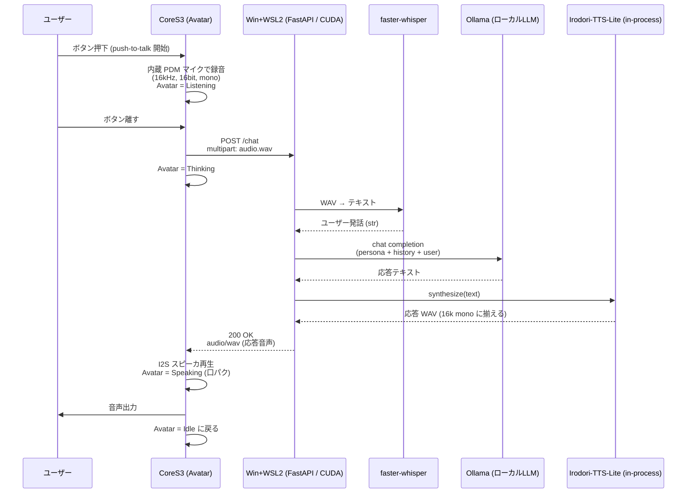

# アーキテクチャ詳細

## 全体シーケンス



## CoreS3 側の状態機械

```
┌────────┐  Btn press  ┌───────────┐ Btn release ┌──────────┐ HTTP 200 ┌──────────┐
│  Idle  │ ──────────► │ Listening │ ──────────► │ Thinking │ ───────► │ Speaking │ ─┐
└────────┘             └───────────┘             └──────────┘          └──────────┘ │
     ▲                                                                              │
     └─────────────────────── 再生完了 ──────────────────────────────────────────────┘
```

ぺけ子ちゃん表情マップ (デフォルト。`face_map.h` で変更可):

| Scene       | 表情 ID | 表情          | 備考 |
|-------------|---------|---------------|------|
| Boot done   | 36      | バイバイ      | 起動直後の挨拶 |
| Idle        | 01      | 中立          | 待機 |
| Listening   | 15      | ？マーク      | 録音中 |
| Thinking    | 21      | 手を顎に      | サーバ応答待ち |
| Speak (閉)  | 02      | 微笑み・口閉  | PCM RMS < 閾値 |
| Speak (開)  | 29      | 笑顔・口開    | PCM RMS ≥ 閾値 |
| Error WiFi  | 32      | あたふた      | Wi-Fi 失敗時 |
| Error HTTP  | 16      | パニック      | サーバ接続失敗 |
| No speech   | 06      | 困り (汗)     | 無音だった時 (将来用) |

## API 仕様 (POST /chat)

**Request**: `multipart/form-data`

| Field    | Type   | 説明 |
|----------|--------|------|
| `audio`  | file   | WAV (RIFF, PCM16, 16kHz, mono) |
| `sid`    | string | セッションID。会話履歴保持用 (任意) |

**Response**:

- 成功: `200 OK`, `Content-Type: audio/wav`, body = 合成 WAV
- 失敗: `4xx/5xx`, JSON `{"error": "..."}`

オプションでデバッグ用に `X-Stackchan-User-Text` / `X-Stackchan-Bot-Text` ヘッダに認識結果と応答テキストを載せる。

## ピン/ハード設定 (暫定)

CoreS3 SE は I2C 周辺と内蔵マイク/スピーカが固定のため、基本は M5Unified が面倒を見る。
スタックちゃんの首振りサーボ (SG90 ×2) は [firmware/include/servo_motion.h](../firmware/include/servo_motion.h) で ESP32Servo 経由で制御:

| 用途        | 想定ピン        | メモ |
|-------------|-----------------|------|
| 首 Yaw      | GPIO 1 (Port.B) | PWM, 50Hz, 500-2400us |
| 首 Pitch    | GPIO 2 (Port.B) | PWM, 50Hz, 500-2400us |
| 内蔵マイク  | M5.Mic          | M5Unified 経由 |
| 内蔵スピーカ| M5.Speaker      | M5Unified 経由 |

> 実機が来たら **Stack-chan Takao Base** の配線図と照合して `config.h` を更新する。サーボ未接続でも `begin()` が失敗するだけで firmware は通常起動する (会話パイプラインは独立)。

### 状態 → サーボ姿勢のマッピング

| State       | Yaw   | Pitch | 印象 |
|-------------|-------|-------|------|
| Boot done   | 70↔110 swing ×3 | 88 | face_36 と同期して「バイバイ」 |
| Idle        | 90    | 88    | 直立 / 中立 |
| Listening   | 90    | 100   | ややお辞儀 (聞いてる姿勢) |
| Thinking    | 78    | 94    | 小首を傾げる |
| Speaking    | 90    | 80↔86 | 口パクの RMS と同期して上下に頷く |
| Error       | (変化なし) | (変化なし) | 直前姿勢を維持 |

角度は `firmware/include/servo_motion.h` の `YAW_CENTER` / `PITCH_NEUTRAL` / `PITCH_FORWARD` を弄れば調整可能。

## なぜこの分担か

- ESP32-S3 では現実的に小さな LLM すら走らせられない (PSRAM 8MB、Flash 16MB)
- 一方で I/O (マイク・スピーカ・Avatar 表示・サーボ) はリアルタイム性が要るのでオンデバイス
- 母艦は Irodori-TTS-Lite が CUDA + Triton 前提なので Windows + WSL2 (Ubuntu) + NVIDIA GPU 構成。faster-whisper / Ollama も同じ GPU を共有して in-process で走る
- HTTP は CoreS3 ↔ 母艦の境界だけに残しておけば、母艦を後で別の Linux GPU マシンに移しても CoreS3 側は無改造で動く
