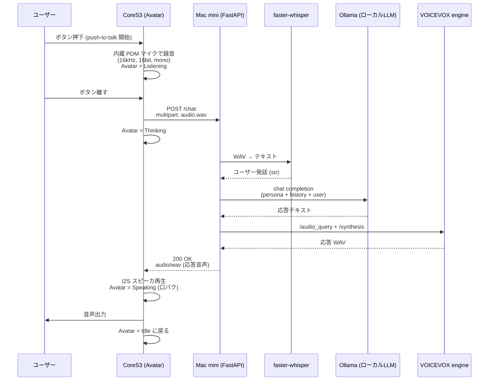

# アーキテクチャ詳細

## 全体シーケンス



## CoreS3 側の状態機械

```
┌────────┐  Btn press  ┌───────────┐ Btn release ┌──────────┐ HTTP 200 ┌──────────┐
│  Idle  │ ──────────► │ Listening │ ──────────► │ Thinking │ ───────► │ Speaking │ ─┐
└────────┘             └───────────┘             └──────────┘          └──────────┘ │
     ▲                                                                              │
     └─────────────────────── 再生完了 ──────────────────────────────────────────────┘
```

ぺけ子ちゃん表情マップ (デフォルト。`face_map.h` で変更可):

| Scene       | 表情 ID | 表情          | 備考 |
|-------------|---------|---------------|------|
| Boot done   | 36      | バイバイ      | 起動直後の挨拶 |
| Idle        | 01      | 中立          | 待機 |
| Listening   | 15      | ？マーク      | 録音中 |
| Thinking    | 21      | 手を顎に      | サーバ応答待ち |
| Speak (閉)  | 02      | 微笑み・口閉  | PCM RMS < 閾値 |
| Speak (開)  | 29      | 笑顔・口開    | PCM RMS ≥ 閾値 |
| Error WiFi  | 32      | あたふた      | Wi-Fi 失敗時 |
| Error HTTP  | 16      | パニック      | サーバ接続失敗 |
| No speech   | 06      | 困り (汗)     | 無音だった時 (将来用) |

## API 仕様 (POST /chat)

**Request**: `multipart/form-data`

| Field    | Type   | 説明 |
|----------|--------|------|
| `audio`  | file   | WAV (RIFF, PCM16, 16kHz, mono) |
| `sid`    | string | セッションID。会話履歴保持用 (任意) |

**Response**:

- 成功: `200 OK`, `Content-Type: audio/wav`, body = 合成 WAV
- 失敗: `4xx/5xx`, JSON `{"error": "..."}`

オプションでデバッグ用に `X-Stackchan-User-Text` / `X-Stackchan-Bot-Text` ヘッダに認識結果と応答テキストを載せる。

## ピン/ハード設定 (暫定)

CoreS3 SE は I2C 周辺と内蔵マイク/スピーカが固定のため、基本は M5Unified が面倒を見る。
スタックちゃんの首振りサーボ (SG90 ×2) は Port.A / Port.B 経由が一般的:

| 用途        | 想定ピン        | メモ |
|-------------|-----------------|------|
| 首 Yaw      | GPIO 1 (Port.B) | PWM, 50Hz |
| 首 Pitch    | GPIO 2 (Port.B) | PWM, 50Hz |
| 内蔵マイク  | M5.Mic          | M5Unified 経由 |
| 内蔵スピーカ| M5.Speaker      | M5Unified 経由 |

> 実機が来たら **Stack-chan Takao Base** の配線図と照合して `config.h` を更新する。

## なぜこの分担か

- ESP32-S3 では現実的に小さな LLM すら走らせられない (PSRAM 8MB、Flash 16MB)
- 一方で I/O (マイク・スピーカ・Avatar 表示・サーボ) はリアルタイム性が要るのでオンデバイス
- 母艦が Mac mini ならば、Apple Silicon の Metal で whisper.cpp / llama.cpp / VOICEVOX いずれも CPU/GPU 効率良く走る
- HTTP に統一しておけば、母艦を後で Linux GPU マシンに変えても CoreS3 側は無改造で動く
